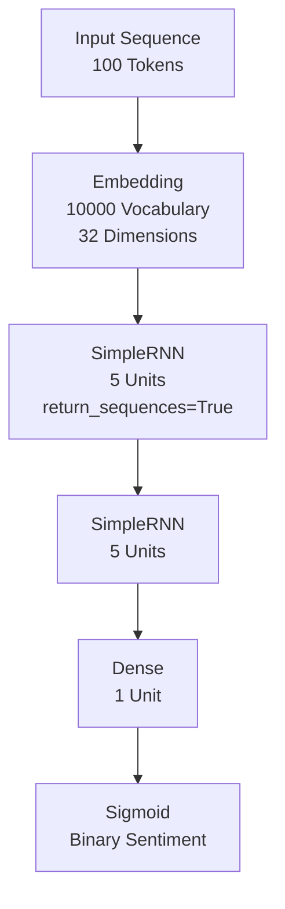
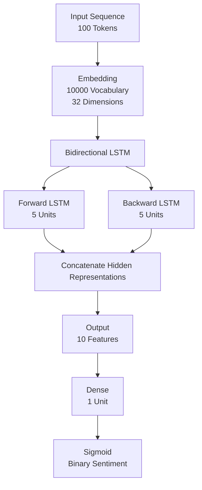
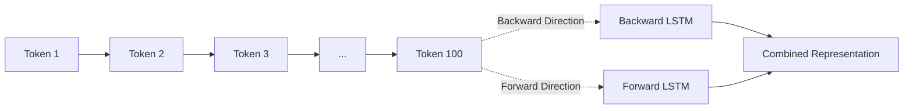
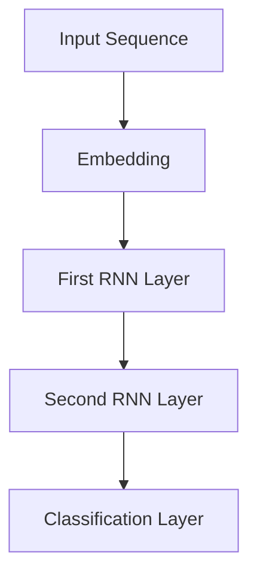
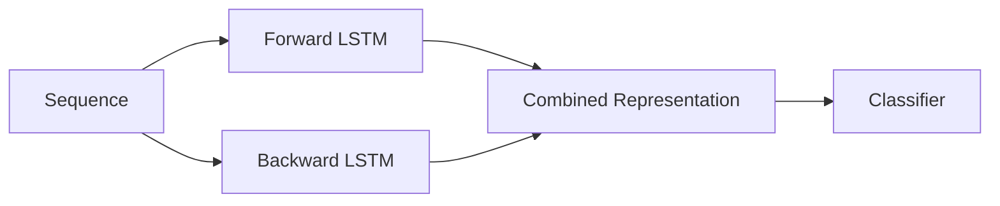
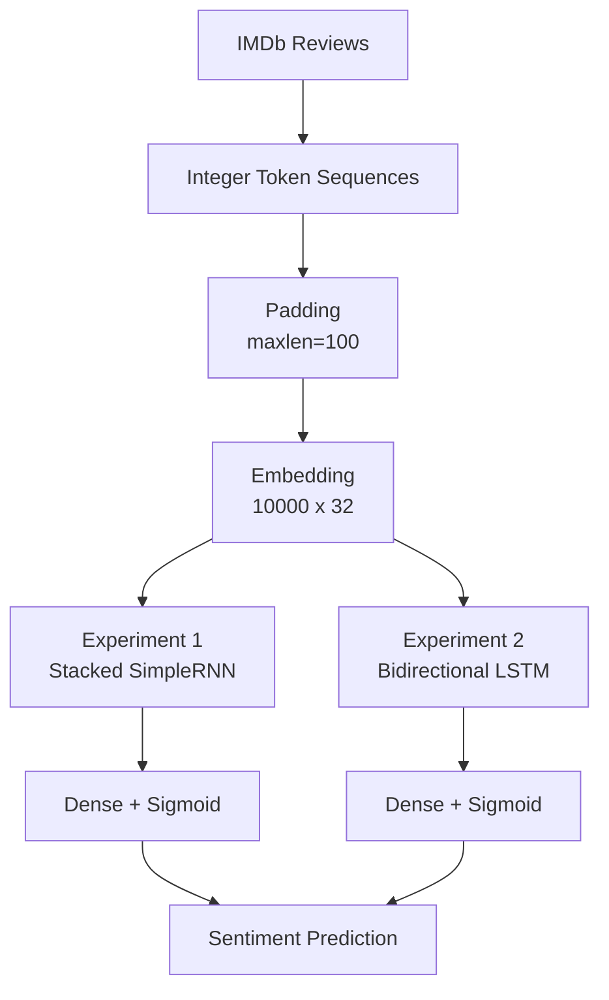

# Deep RNNs: Stacked RNN and Bidirectional LSTM for Sentiment Classification

## Overview

This project explores deeper recurrent neural network architectures for text classification using the IMDb movie review dataset.

The notebook implements and compares two different recurrent architectures:

1. A stacked SimpleRNN model
2. A Bidirectional LSTM model

The objective is to understand how increasing recurrent depth and using bidirectional sequence processing affects the model's ability to learn contextual information from text.

The models perform binary sentiment classification, predicting whether an IMDb movie review is positive or negative.

---

## Objectives

The main objectives of this project are:

- Understand recurrent neural networks for sequential text data.
- Build a stacked RNN architecture using multiple `SimpleRNN` layers.
- Understand the role of `return_sequences=True` in deep RNN architectures.
- Build a Bidirectional LSTM model.
- Compare the parameter counts and performance of both architectures.
- Analyze validation performance and generalization.
- Understand how recurrent architectures process sequential context.

---

## Dataset

The project uses the IMDb Movie Reviews dataset available through TensorFlow/Keras.

The dataset contains:

- 25,000 training reviews
- 25,000 testing reviews
- Binary sentiment labels
- Positive and negative reviews

The vocabulary is restricted to the top 10,000 most frequent words.

```python
imdb.load_data(num_words=10000)
```

Each review is represented as a sequence of integer token IDs.

Since different reviews have different lengths, the sequences are padded or truncated to a fixed length of 100.

```python
X_train = pad_sequences(X_train, maxlen=100)
X_test = pad_sequences(X_test, maxlen=100)
```

Therefore, the input to the models has the shape:

```text
(batch_size, 100)
```

where `100` represents the maximum sequence length.

---

# Data Representation

Before entering the recurrent layers, the integer word IDs are converted into dense vector representations using an Embedding layer.

```text
Token IDs
   |
   v
Embedding
   |
   v
Dense Word Representations
   |
   v
Recurrent Layers
```

The embedding configuration used in the notebook is:

```python
Embedding(10000, 32)
```

This means:

- Vocabulary size = 10,000
- Embedding dimension = 32

Each token is therefore represented by a 32-dimensional vector.

The shape changes from:

```text
(batch_size, 100)
```

to:

```text
(batch_size, 100, 32)
```

---

# Model 1: Stacked SimpleRNN

The first experiment uses two `SimpleRNN` layers stacked on top of each other.

```python
model = Sequential([
    Input(shape=(100,)),
    Embedding(10000, 32),
    SimpleRNN(5, return_sequences=True),
    SimpleRNN(5),
    Dense(1, activation='sigmoid')
])
```

## Architecture



### Why is `return_sequences=True` required?

The first `SimpleRNN` must pass the complete sequence to the next recurrent layer.

The first RNN therefore produces:

```text
(batch_size, 100, 5)
```

The second RNN receives this entire sequence and processes it.

Because the second RNN is the final recurrent layer, it returns only its final hidden state:

```text
(batch_size, 5)
```

The final Dense layer then converts this representation into a single probability.

---

## SimpleRNN Shape Flow

```text
Input
(batch_size, 100)
        |
        v
Embedding
(batch_size, 100, 32)
        |
        v
SimpleRNN(5, return_sequences=True)
(batch_size, 100, 5)
        |
        v
SimpleRNN(5)
(batch_size, 5)
        |
        v
Dense(1, sigmoid)
(batch_size, 1)
```

## Parameter Count

The model contains:

```text
Embedding:      320,000
SimpleRNN:          190
SimpleRNN:           55
Dense:                6
--------------------------------
Total:           320,251
```

---

# Model 2: Bidirectional LSTM

The second experiment replaces the stacked SimpleRNN architecture with a Bidirectional LSTM.

```python
model = Sequential([
    Input(shape=(100,)),
    Embedding(10000, 32),
    Bidirectional(LSTM(5)),
    Dense(1, activation='sigmoid')
])
```

## Architecture



A Bidirectional LSTM processes the sequence in both directions.



The forward LSTM processes the sequence from beginning to end, while the backward LSTM processes it from end to beginning.

This allows the model to use information from both sides of a token when constructing its contextual representation.

---

# Why Bidirectional LSTM?

A normal recurrent model primarily processes information sequentially from the beginning toward the end.

For example:

```text
The movie was not very good
```

Understanding the importance of a word can depend on information appearing later in the sequence.

A Bidirectional LSTM processes:

```text
Forward:
The -> movie -> was -> not -> very -> good

Backward:
good -> very -> not -> was -> movie -> The
```

The two representations are then combined.

This provides the model with contextual information from both directions.

---

# Bidirectional LSTM Shape Flow

```text
Input
(batch_size, 100)
        |
        v
Embedding
(batch_size, 100, 32)
        |
        v
Bidirectional(LSTM(5))
        |
        +--------------------+
        |                    |
        v                    v
Forward LSTM            Backward LSTM
5 units                 5 units
        |                    |
        +---------+----------+
                  |
                  v
         Concatenated Output
         (batch_size, 10)
                  |
                  v
             Dense(1)
                  |
                  v
          Sigmoid Output
```

---

# Parameter Count

The Bidirectional LSTM model contains:

```text
Embedding:          320,000
Bidirectional LSTM:   1,520
Dense:                   11
--------------------------------
Total:              321,531
```

The Bidirectional LSTM has slightly more parameters than the stacked SimpleRNN model because an LSTM contains more internal gates and the bidirectional wrapper contains two LSTM networks.

---

# Training Configuration

Both models were trained using:

```python
optimizer = 'adam'
loss = 'binary_crossentropy'
metrics = ['accuracy']
```

Training configuration:

```text
Epochs:             5
Batch Size:         32
Validation Split:   0.2
Loss Function:      Binary Crossentropy
Optimizer:          Adam
Evaluation Metric:  Accuracy
```

The final output layer is:

```python
Dense(1, activation='sigmoid')
```

The sigmoid activation produces a value between 0 and 1, which can be interpreted as the probability of the review belonging to the positive class.

---

# Results

## Stacked SimpleRNN

The SimpleRNN model achieved the following results during training:

| Metric | Final Value |
|---|---:|
| Training Accuracy | 0.9441 |
| Validation Accuracy | 0.8168 |
| Training Loss | 0.1609 |
| Validation Loss | 0.4929 |
| Total Parameters | 320,251 |

The training accuracy continues to increase while validation accuracy remains considerably lower.

This indicates that the model is learning the training data well but is beginning to overfit.

---

## Bidirectional LSTM

The Bidirectional LSTM achieved:

| Metric | Final Value |
|---|---:|
| Training Accuracy | 0.9539 |
| Validation Accuracy | 0.8280 |
| Training Loss | 0.1293 |
| Validation Loss | 0.4978 |
| Total Parameters | 321,531 |

The Bidirectional LSTM achieves a slightly higher validation accuracy than the stacked SimpleRNN.

---

# Model Comparison

| Aspect | Stacked SimpleRNN | Bidirectional LSTM |
|---|---|---|
| Recurrent Architecture | 2 × SimpleRNN | Bidirectional LSTM |
| Recurrent Units | 5 + 5 | 5 forward + 5 backward |
| Sequence Processing | Forward | Forward + Backward |
| Gating Mechanism | No | Yes |
| Parameters | 320,251 | 321,531 |
| Final Training Accuracy | 94.41% | 95.39% |
| Final Validation Accuracy | 81.68% | 82.80% |
| Final Training Loss | 0.1609 | 0.1293 |
| Final Validation Loss | 0.4929 | 0.4978 |

---

# Results Interpretation

The Bidirectional LSTM performs slightly better on the validation set:

```text
SimpleRNN Validation Accuracy
81.68%

Bidirectional LSTM Validation Accuracy
82.80%

Improvement
1.12 percentage points
```

The improvement is relatively small, so it would be incorrect to claim that the Bidirectional LSTM dramatically outperforms the SimpleRNN.

However, the experiment demonstrates an important architectural difference.

The Bidirectional LSTM has two advantages:

1. LSTM uses gating mechanisms to control information flow and maintain useful information over longer sequences.
2. Bidirectional processing allows the model to incorporate information from both directions of the sequence.

---

# Overfitting Observation

Both models show a noticeable gap between training and validation performance.

For example, the Bidirectional LSTM reaches approximately:

```text
Training Accuracy:   95.39%
Validation Accuracy: 82.80%
```

while the SimpleRNN reaches:

```text
Training Accuracy:   94.41%
Validation Accuracy: 81.68%
```

This indicates that both models are fitting the training data substantially better than they generalize to unseen validation data.

The increasing validation loss toward the later epochs is another indication of overfitting.

Possible approaches to improve generalization include:

- Dropout
- Recurrent dropout
- Early stopping
- L2 regularization
- Increasing the training data
- Hyperparameter tuning
- Using pretrained embeddings
- Adjusting sequence length
- Increasing or decreasing model capacity appropriately

---

# Key Concepts Demonstrated

## 1. Sequence Padding

Reviews have different lengths, so padding creates a fixed-size input:

```text
Original:
[12, 45, 78, 23]

After padding to 100:
[0, 0, 0, ..., 12, 45, 78, 23]
```

This allows batches of reviews to be processed efficiently.

---

## 2. Embedding

The embedding layer converts discrete token IDs into continuous vectors.

```text
Token ID
   |
   v
Embedding Layer
   |
   v
32-dimensional vector
```

This allows the recurrent network to operate on learned numerical representations of words.

---

## 3. Stacked RNNs

Multiple recurrent layers can be stacked to create a deeper recurrent network.



The first recurrent layer extracts sequential features that are then processed by the second recurrent layer.

---

## 4. Bidirectional Processing

Bidirectional recurrent networks process the sequence from both directions.



This gives the model access to both preceding and following contextual information.

---

## 5. Sigmoid for Binary Classification

The final layer is:

```python
Dense(1, activation='sigmoid')
```

The output is a probability:

```text
0 ---------------------- 1
Negative              Positive
```

A value closer to `0` represents the negative class, while a value closer to `1` represents the positive class.

---

# Overall Architecture Comparison



---

# Conclusion

This notebook demonstrates how different recurrent architectures can be applied to sentiment classification.

The stacked SimpleRNN provides a straightforward example of building a deeper recurrent network, while the Bidirectional LSTM demonstrates how gated recurrent units and bidirectional processing can improve contextual representation.

In this experiment:

```text
Stacked SimpleRNN
Validation Accuracy = 81.68%

Bidirectional LSTM
Validation Accuracy = 82.80%
```

The Bidirectional LSTM achieves a modest improvement in validation accuracy while using only slightly more parameters.

The experiment also highlights the importance of evaluating validation performance rather than relying solely on training accuracy, as both models exhibit signs of overfitting.

---
